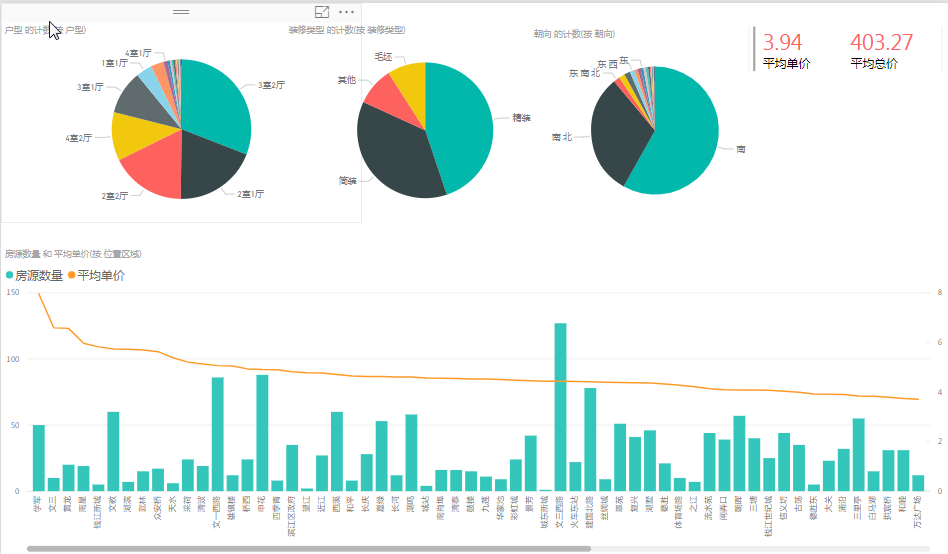
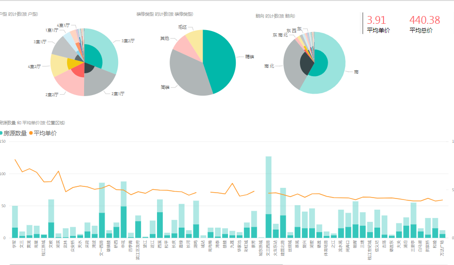
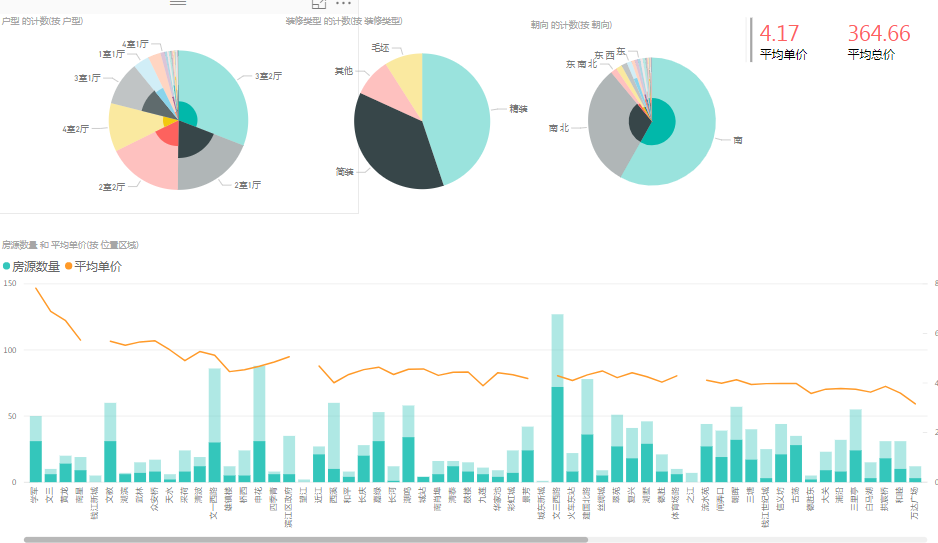

##### 施工中...
## [杭州租房分析](#杭州租房分析)
### 杭州租房分析
1. scrapy爬虫抓取安居客和房天下的数据用pandas 和 excel 清洗整理后导入
 

2. 首先看房源数量与平均价
安居客的

可以看到拱墅江干与西湖区的数量比其他城区要多些有可能是城区较大的缘故 均价是滨江最高 临安可能是一个异常值
 
数量太少意义不大除去这部分
 
然后是房天下的数据

对比发现上城区的数值异常的高
查看数据源 原来是面积比较大

3. 从租房类型看：
安居客

房天下

可以看出2家的业务区别安居客比较注重于整租而房天下的则是都涉及一半并且在合租中细分了单间 主卧 和次卧类型
4. 从价格分布来看

安居客

房天下

结论：杭州租房均价比较平稳波动幅度不大 某些地段好的可能会偏高很多，单价都差不多，租房价格与面积有直接的关系
整租比合租拥有更多的房源
合租基本都是集中在1000-2000的区间少部分2000-3000
整租绝大部分大于2000以上
## 以下使用power bi进行描述分析
    （具体可以下载文件直接点击需要的项目向下钻取就可以动态查看各项变化） 
1. ### [链家杭州二手房分析](#1.链家杭州二手房分析)
2. ### [优信网杭州二手车分析](#2.优信网杭州二手车分析)
3. ### [猫眼票房分析预测](#3.猫眼票房分析预测)
### [4.世界粮食1961-2013年分析](#4.[世界粮食1961-2013年分析])
### [5.titanic生存预测](#5.[titanic生存预测])
### 1.链家杭州二手房分析
图列

### 2.优信网杭州二手车分析
图列

+ 二手车的品牌构成主要是美系和德系占了一半以上，车型以三厢为主，大众车的排量大都小于2.0L 宝马奥迪则大都是2.0L

+ 新车 旧车差价随着使用年限 里程数的增加而增加
+ 从最划算的购买角度看是11.2里程的奔驰和路虎 62与79个月的德系车最具优势

### 3.猫眼票房分析预测
buliding...
## 4.[世界粮食1961-2013年分析](http://nbviewer.jupyter.org/github/Se9t/datasci/blob/master/datasci/fao_aly.ipynb)
## 5.[titanic生存预测](http://nbviewer.jupyter.org/github/Se9t/datasci/blob/master/datasci/titanic_pre.ipynb)