##### 施工中...
1. 车，房，票房为scrapy爬虫抓取 粮食 titanic 为kaggle数据集下载
2. mod为经过pandas powebi数据清洗整理后的文件，其他类似文件为抓取后未处理文件
## 1.链家杭州二手房分析

pass

## 2.优信网杭州二手车分析
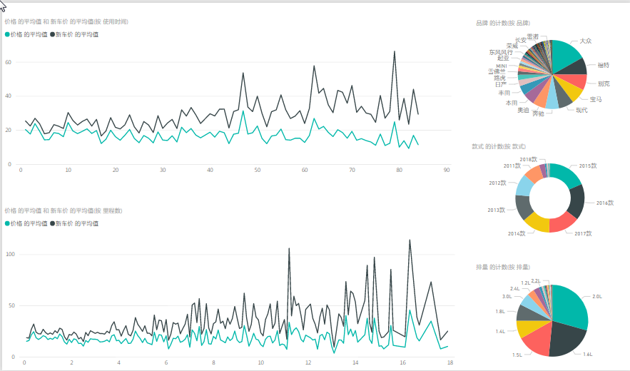
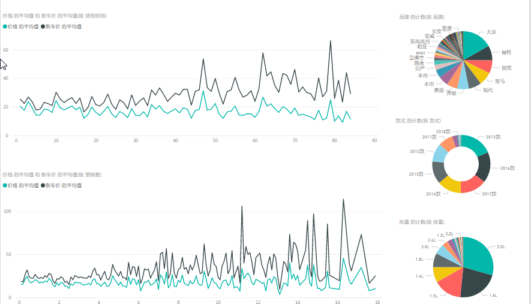
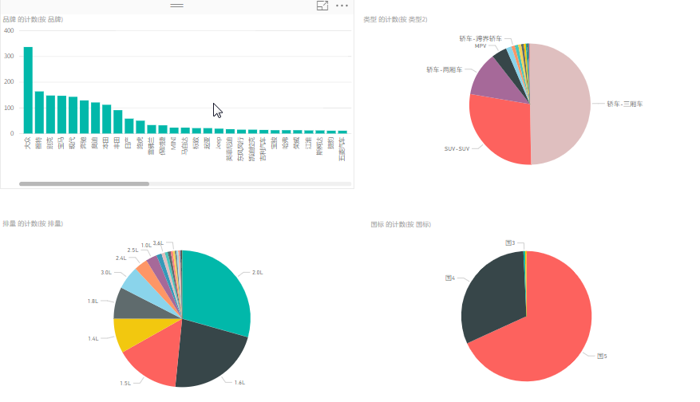
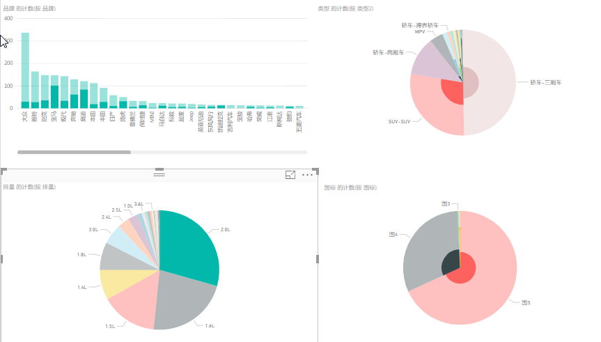
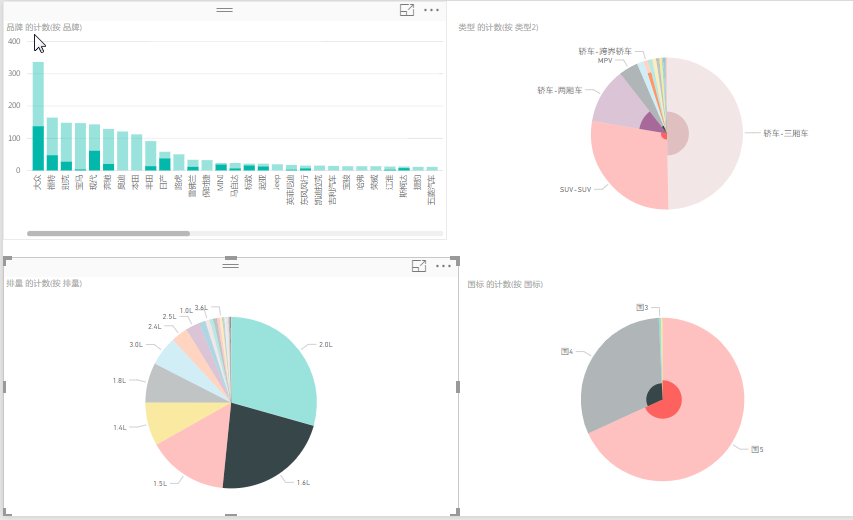
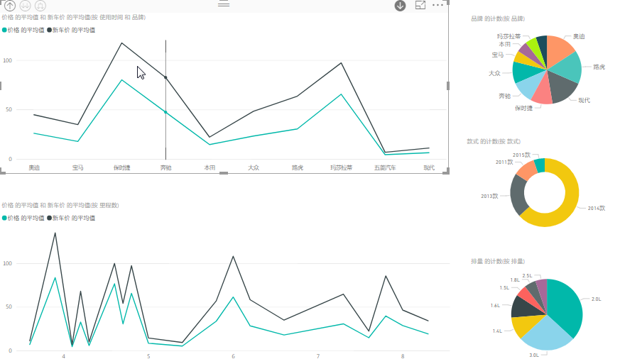
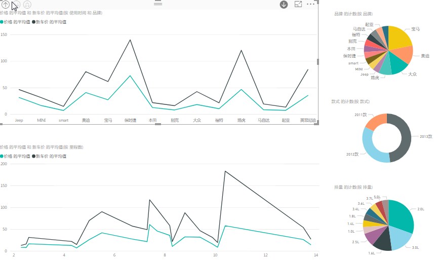
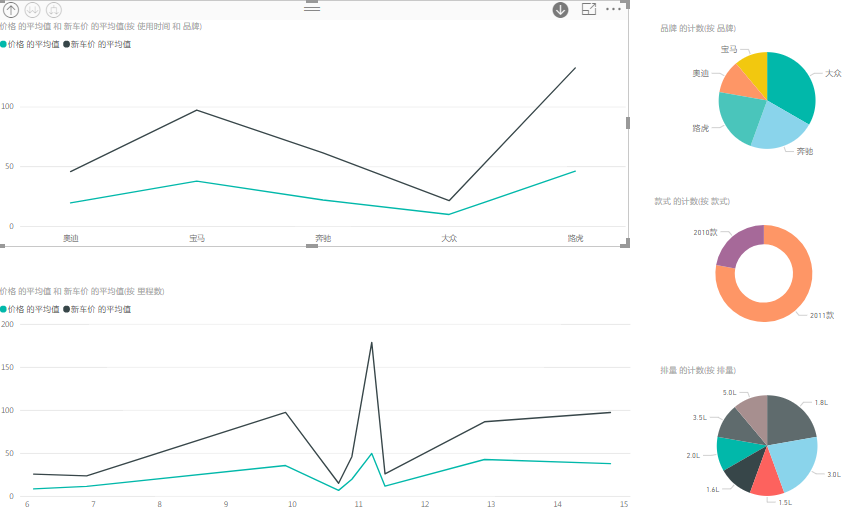
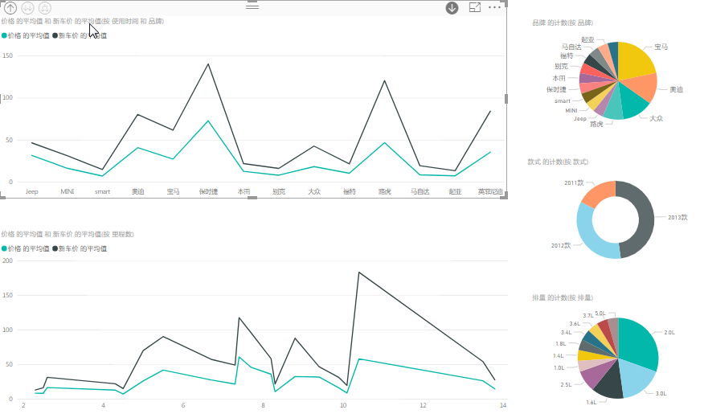
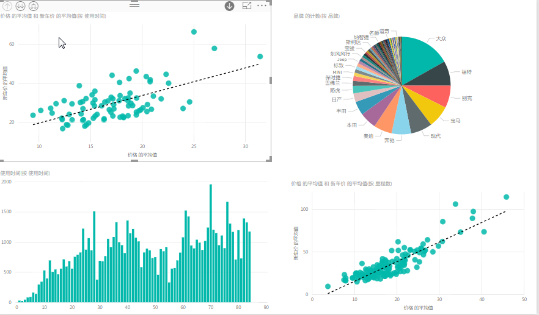
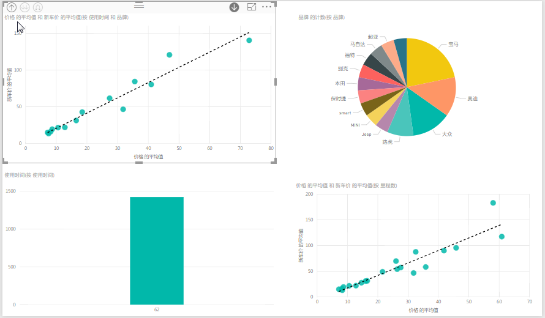
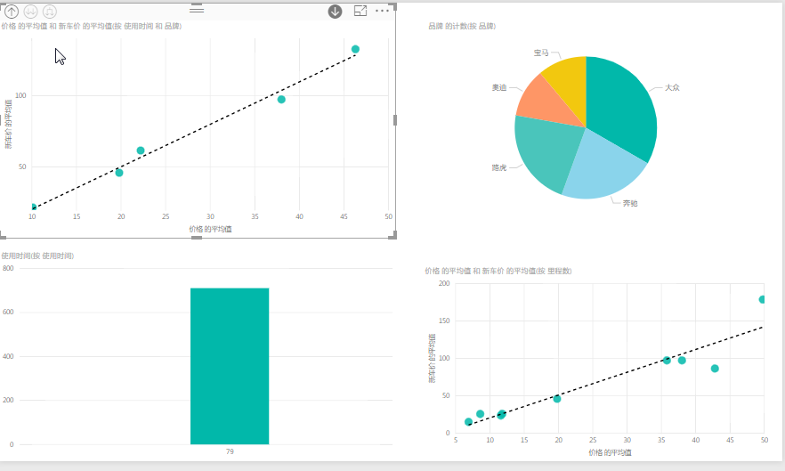
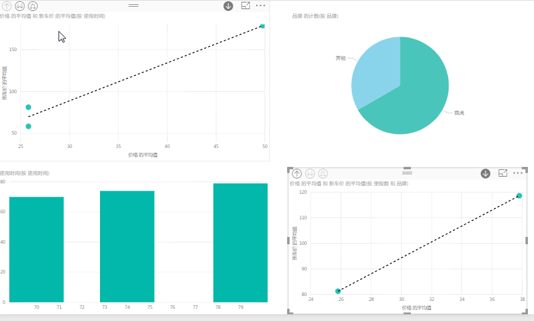

+ 二手车的品牌构成主要是美系和德系占了一半以上，车型以三厢为主，大众车的排量大都小于2.0L 宝马奥迪则大都是2.0L

+ 新车 旧车差价随着使用年限 里程数的增加而增加
+ 从最划算的购买角度看是11.2里程的奔驰和路虎 62个月与79的德系车最具优势

## 3.猫眼票房分析预测
pass
## 4.[世界粮食1961-2013年分析](./fao_aly.ipynb)
## 5.[titanic生存预测](./titanic_pre.ipynb)
