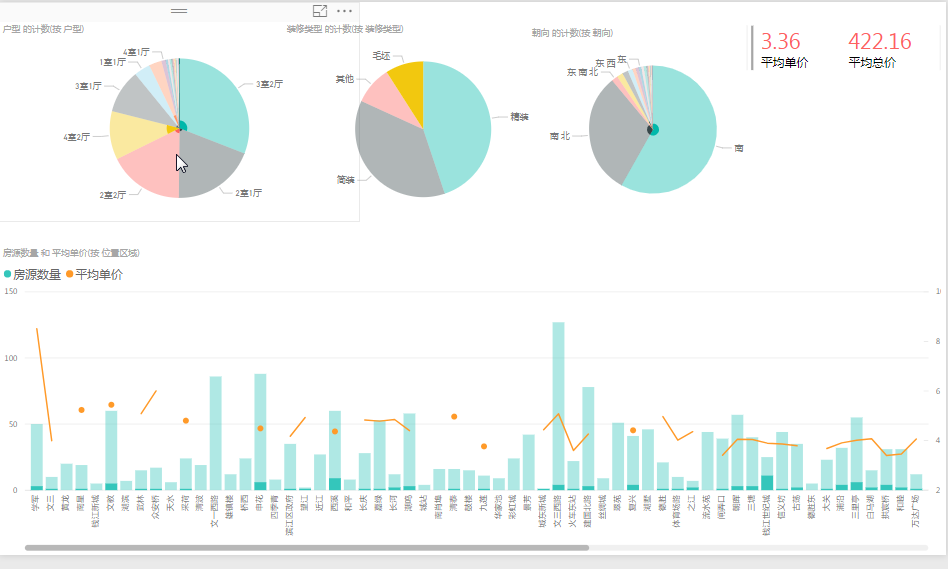

##### 施工中...
## [杭州租房分析](#杭州租房分析)
### 杭州租房分析
1. scrapy爬虫抓取安居客和房天下的数据用pandas 和 excel 清洗整理后导入
 

2. 首先看房源数量与平均价
    安居客的
    
    可以看到拱墅江干与西湖区的数量比其他城区要多些有可能是城区较大的缘故 均价是滨江最高 临安可能是一个异常值
     
    
    数量太少意义不大除去这部分
     
    然后是房天下的数据
    
    对比发现上城区的数值异常的高
    查看数据源 原来是面积比较大
    

3. aa

1. 车，房，票房为scrapy爬虫抓取 粮食 titanic 为kaggle数据集下载
2. mod为经过pandas powebi数据清洗整理后的文件，其他类似文件为抓取后未处理文件
### [1.链家杭州二手房分析](#1.链家杭州二手房分析)
### [2.优信网杭州二手车分析](#2.优信网杭州二手车分析)
### [3.猫眼票房分析预测](#3.猫眼票房分析预测)
### [4.世界粮食1961-2013年分析](#4.[世界粮食1961-2013年分析])
### [5.titanic生存预测](#5.[titanic生存预测])
### 1.链家杭州二手房分析
样本数量3000条

pass

## 2.优信网杭州二手车分析
样本数量2000条

+ 二手车的品牌构成主要是美系和德系占了一半以上，车型以三厢为主，大众车的排量大都小于2.0L 宝马奥迪则大都是2.0L

+ 新车 旧车差价随着使用年限 里程数的增加而增加
+ 从最划算的购买角度看是11.2里程的奔驰和路虎 62与79个月的德系车最具优势

## 3.猫眼票房分析预测
从2011-1-1至2018-4-28为止
样本数量61000条
pass
## 4.[世界粮食1961-2013年分析](http://nbviewer.jupyter.org/github/Se9t/datasci/blob/master/datasci/fao_aly.ipynb)
## 5.[titanic生存预测](http://nbviewer.jupyter.org/github/Se9t/datasci/blob/master/datasci/titanic_pre.ipynb)